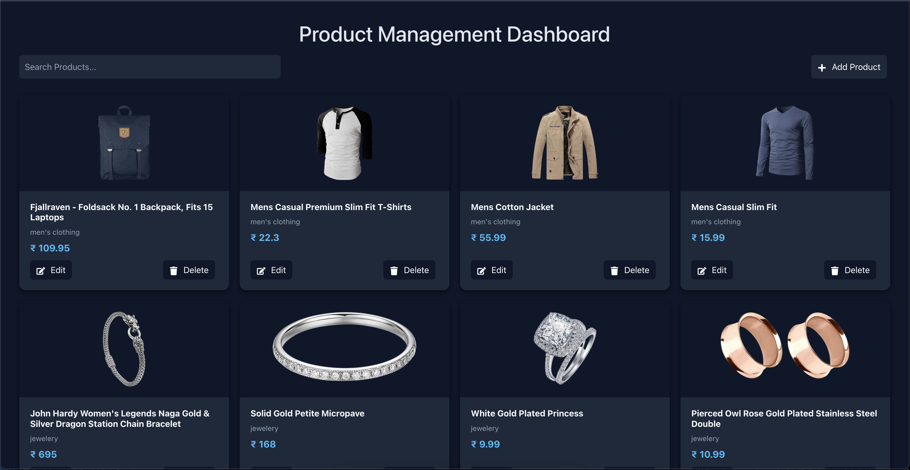

# 🧪 Product Management Dashboard – React.js

A **mini product management dashboard** built with **React.js**, designed to showcase CRUD operations (Create, Read, Update, Delete) through real-time API interactions. This project demonstrates practical knowledge of **React hooks**, **API integration**, and **UI state management** — ideal for learning and interview portfolios.

---

## 🚀 Features

### 🗂️ 1. Fetch & Display Products
- Integrated with the **[Fake Store API](https://fakestoreapi.com/products)** to fetch and render product data.
- Products are displayed in a clean, responsive **table/card layout**.
- Includes loading and error handling states.

### ➕ 2. Add New Product
- A form interface to **add new products** using a mock `POST` request.
- Automatically updates the product list on successful creation.
- Simulates a real-world admin “Add Product” workflow.

### ✏️ 3. Edit Product
- Allows inline or modal-based **editing of product details**.
- Updates product information locally after a successful `PUT` request.
- Mimics real-world inventory management behavior.

### 🗑️ 4. Delete Product
- Enables **product deletion** via a `DELETE` request.
- Reflects the change instantly in the UI after successful API response.
- Includes optional delete confirmation for better UX.

### 🔍 5. Search & Filter
- **Client-side search** by product name or category.
- Optional **dynamic filtering** using category-based API endpoint:

- Provides a smooth and responsive filtering experience.

---

## 🛠️ Tech Stack

| Technology | Purpose |
|-------------|----------|
| **React.js (v18)** | Frontend framework |
| **Axios / fetch()** | API handling |
| **React Hooks (useState, useEffect)** | State and side effects |
| **CSS / Bootstrap / Tailwind** | UI styling (based on implementation) |

---

## 🧠 Learnings & Highlights

Mastered API CRUD operations with React.

Enhanced UI/UX responsiveness with dynamic state updates.

Improved understanding of data handling and mock API testing.

Demonstrated ability to build real-world dashboards using React.

## 📸 Demo Preview

